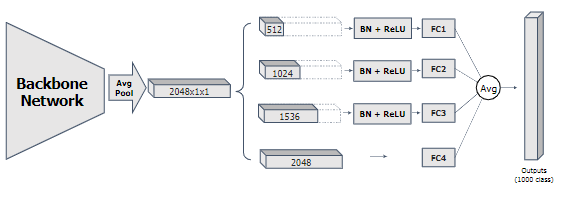

<div align="center">


</div>

# python_developer_tools
> python 开发过程中常用到的工具;包括网站开发,人工智能,文件，数据类型转换
> 支付接口对接，外挂，bat,sh等我在工作中常用到的开发工具
> 1. 制作一个可插拔的python开发工具
> 2. 论文复现
> 3. 深度学习tricks收集

## 安装和使用
```shell script
pip uninstall python_developer_tools
pip install git+https://github.com/carlsummer/python_developer_tools.git
from python_developer_tools import cv
```

***
# Contents
- [cv 计算机视觉](#cv-计算机视觉)
    - [基础组成成分](#基础组成成分)
        - [input_conv 输入给网络之前的一步操作](./python_developer_tools/cv/bases/input_conv/README.md)
            - **SpaceToDepth**
        - [Convolution Series](#Convolution-series)
            - **Depthwise Separable Convolution Usage**
            - **MBConv**
            - **Involution**
        - [attentions注意力机制](./python_developer_tools/cv/bases/attentions/README.md)
            - **Squeeze-and-Excitation Networks**
            - **Residual Attention**
        - [BN](./python_developer_tools/cv/bases/BatchNormalization/README.md)
            - **inplace_abn**
        - [activates 激活函数](#activates)
            - **ReLU**
            - **LeakyReLU**
            - **relu6**
            - **SiLU**
            - **sigmoid**
            - **Swish**
            - **Adaptively-Parametric-ReLU**
            - **DynamicReLU**
            - **softmax序列**
                - **softmax**
                - **norm_softmax**
                - **sinmax**
                - **norm_sinmax**
                - **cosmax**
                - **norm_cosmax**
                - **sin_2_max**
                - **norm_sin_2_max**
                - **sin_2_max_move**
                - **norm_sin_2_max_move**
                - **sirenmax**
                - **norm_sirenmax**
                - **sin_softmax**
                - **norm_sin_softmax**
            - **serf**
        - [全连接FC]
            - [SSM](#SSM)
        - [池化pool](./python_developer_tools/cv/bases/pool/README.md)
            - **SoftPool**
            - **GlobalAvgPool2d**
            - **BlurPool**
            - **SPP**
        - [regularization](./python_developer_tools/cv/bases/regularization.py)
    - 分类classes
        - demo
            - [训练cifar10数据集](test/train_cifar10.py)
        - [分类模型classnetwork](#classnetwork)
    - datasets
        - [数据增强](./python_developer_tools/cv/datasets/README.md)
            - 分类任务数据增强
                - 图片自动对比度
                - 直方图增强
                - mix_data
                - [APR](./python_developer_tools/cv/datasets/classes/APR.py)
                    - **posterize**
                    - **rotate**
                    - **solarize**
                    - **shear_x**
                    - **shear_y**
                    - **translate_x**
                    - **translate_y**
                    - **color**
                    - **contrast**
                    - **brightness**
                    - **sharpness**
            - 直线检测数据增强
                - **cutout**
                - 旋转透视变换
        - 数据集读取
    - [scheduler](./python_developer_tools/cv/scheduler/README.md)
        - **ExpLR**
        - **WarmupExponentialLR**
        - **StepLR**
        - **WarmupStepLR**
        - **MultiStepLR**
        - **WarmupMultiStepLR**
        - **CosineLR**
        - **WarmupCosineAnnealingLR**
        - **LambdaLR**
        - **ReduceLROnPlateau**
        - **CosineAnnealingWarmRestarts**
        - **CyclicLR**
        - **OneCycleLR**
        - **PolyLR**
    - [optimizer](./python_developer_tools/cv/optimizer/README.md)
        - **SGD**
        - **ASGD**
        - **Adagrad**
        - **Adadelta**
        - **RMSprop**
        - **Adam**
        - **Adamax**
        - **SparseAdam**
        - **L-BFGS**
        - **Rprop**
        - **AdamW**
        - **RAdam**
        - **Ranger**
        - **LARS**
    - [loss](./python_developer_tools/cv/loss/README.md)
        - **CenterLoss**
        - **CrossEntropyLoss**
        - **Diceloss**
        - **focalloss**
        - **LabelSmoothingCrossEntropy**
        - **OHEMloss**
        - **OIMloss**
        - **topk_crossEntrophy**
        - **TripletLoss**
        - **NLLLoss**
    - train
        - 二阶段训练
            - [swa](./python_developer_tools/cv/train/二阶段训练/swa_pytorch.py)
            - [swaoffline](./python_developer_tools/cv/train/二阶段训练/swaoffline.py)
        - [对抗训练](./python_developer_tools/cv/train/对抗训练/README.md)
            - **FGSM**
            - **PGD**
    - utils
        - [tensorboard](./python_developer_tools/cv/utils/tensorboard_demo.py)
        - [torch_utils](#torch_utils)
    - [label标准工具](./python_developer_tools/cv/label_tools.md)
- [files](#files)
    - [common](#common)
    - [pickle](#pickle)
- [machinelearning](./python_developer_tools/machinelearning/README.md)
    - **KFold**
    - **SVM**
    - **knn**
- [python]
    - [threadings](#threadings)
        - multiprocessing_utils
***

### [Convolution-series](./python_developer_tools/cv/bases/conv/README.md)
| 名称      |    csdn | 
| :-------- | --------:| 
| [Depthwise Separable Convolution](./python_developer_tools/cv/bases/conv/DepthwiseSeparableConvolution.py)  | |
| [MBConv](./python_developer_tools/cv/bases/conv/MBConv.py)  | |
| [Involution](./python_developer_tools/cv/bases/conv/Involution.py)  | |

### [activates](./python_developer_tools/cv/bases/activates/README.md)
| 名称      |    csdn | 
| :-------- | --------:| 
| [Adaptively-Parametric-ReLU](./python_developer_tools/cv/bases/activates/APReLU.py)  | |
| [DynamicReLU](./python_developer_tools/cv/bases/activates/DynamicReLU.py)  | [解析](https://blog.csdn.net/Carlsummer/article/details/119730645)|


#### SSM
##### Paper
[Exploiting Featureswith Split-and-Share Module](https://arxiv.org/abs/2108.04500)
##### Overview

##### code
```python
from python_developer_tools.cv.bases.FC.SSM import SSM
import torch
x = torch.randn(2, 2048, 1, 1)
x = x.view(x.size(0), -1)
model = SSM()
out = model(x)
print(out.shape)
```

### classnetwork
| 名称      |    代码实例 | 
| :-------- | --------:| 
| AlexNet  | [实现](./python_developer_tools/cv/classes/AlexNet.py)|
| DenseNet  | [实现](./python_developer_tools/cv/classes/DenseNet.py)|
| Efficientnet  | [实现](./python_developer_tools/cv/classes/Efficientnet.py)|
| InceptionV1  | [实现](./python_developer_tools/cv/classes/InceptionV1.py)|
| InceptionV2  | [实现](./python_developer_tools/cv/classes/InceptionV2.py)|
| InceptionV3  | [实现](./python_developer_tools/cv/classes/InceptionV3.py)|
| repVGGNet  | [实现](./python_developer_tools/cv/classes/repVGGNet.py)|
| ResNet  | [实现](./python_developer_tools/cv/classes/ResNet.py)|
| ResNeXt  | [实现](./python_developer_tools/cv/classes/ResNeXt.py)|
| VGGNet  | [实现](./python_developer_tools/cv/classes/VGGNet.py)|
| GhostNet  | [实现](./python_developer_tools/cv/classes/GhostNet.py)|
| MixNet  | [实现](./python_developer_tools/cv/classes/MixNet.py)|
| MobileNetV1  | [实现](./python_developer_tools/cv/classes/MobileNetV1.py)|
| MobileNetV2  | [实现](./python_developer_tools/cv/classes/MobileNetV2.py)|
| MobileNetV3  | [实现](./python_developer_tools/cv/classes/MobileNetV3.py)|
| MobileNetXt  | [实现](./python_developer_tools/cv/classes/MobileNetXt.py)|
| ShuffleNet  | [实现](./python_developer_tools/cv/classes/ShuffleNet.py)|
| ShuffleNetV2  | [实现](./python_developer_tools/cv/classes/ShuffleNetV2.py)|
| SqueezeNet  | [实现](./python_developer_tools/cv/classes/SqueezeNet.py)|
| Xception  | [实现](./python_developer_tools/cv/classes/Xception.py)|

### [torch_utils](./python_developer_tools/cv/utils/torch_utils.py)
<table>
    <thead>
        <tr><th>名称</th><th>功能</th></tr>
    </thead>
    <tbody>
        <tr><td>init_seeds</td><td>固定pytorch训练时所有的随机种子</td></tr>
        <tr><td>cuda2cpu</td><td>将pytorch的变量从cuda内存中移动到cpu的内存中</td></tr>
        <tr><td>select_device</td><td>选择训练设备</td></tr>
        <tr><td>collect_env_info</td><td>打印python，cuda，cudnn，torch等版本</td></tr>
        <tr><td>labels_to_image_weights</td><td>根据图片样本数量计算weights</td></tr>
        <tr><td>init_cudnn</td><td>加速训练还是追求模型性能</td></tr>
        <tr><td>get_world_size</td><td>返回全局的整个的进程数</td></tr>
        <tr><td>get_rank</td><td>执行该脚本的进程的rank</td></tr>
    </tbody>
</table>

# files
## [common](./python_developer_tools/files/common.py)
<table>
    <thead>
        <tr><th>名称</th><th>功能</th></tr>
    </thead>
    <tbody>
        <tr><td>get_filename_suf_pix</td><td>获取路径的文件名,后缀,父路径</td></tr>
    </tbody>
</table>

## [pickle](./python_developer_tools/files/pickle_utils.py)
<table>
    <thead>
        <tr><th>名称</th><th>功能</th></tr>
    </thead>
    <tbody>
        <tr><td>write_pkl</td><td>将数据存储为pkl</td></tr>
        <tr><td>read_pkl</td><td>读取pkl文件的内容</td></tr>
    </tbody>
</table>