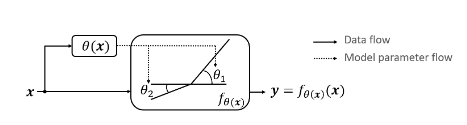
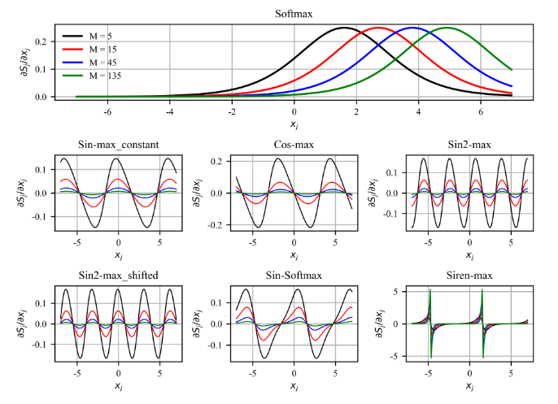

# relu
##### code
```python
import torch.nn as nn
relu = nn.ReLU(inplace=True)
```

# LeakyReLU
##### code
```python
import torch.nn as nn
leakyrelu = nn.LeakyReLU(inplace=True)
```

# relu6
##### code
```python
import torch.nn as nn
relu6 = nn.ReLU6(inplace=True)
```

# SiLU
##### code
```python
import torch.nn as nn
silu = nn.SiLU(inplace=True)
```

# sigmoid
## code
```python
import torch
a = torch.randn(4)
a = torch.sigmoid(a)
```

# Swish
##### code
```python
import torch
import torch.nn as nn
class Swish(nn.Module):
    def forward(self, x):
        return x * torch.sigmoid(x)
swish = Swish()
```


# ACON
1. https://mp.weixin.qq.com/s/BwnsqwECR9xmUjFsxDf1AQ
2. 论文地址：https://arxiv.org/abs/2009.04759
3. 代码：https://github.com/nmaac/acon

***
# APReLU (Adaptively-Parametric-ReLU)
## Paper
[Adaptively-Parametric-ReLU](https://ieeexplore.ieee.org/document/8998530)

## Overview


##### Code
1. 感谢[代码来源PlumedSerpent/Adaptively-Parametric-RELU-pytorch](https://github.com/PlumedSerpent/Adaptively-Parametric-RELU-pytorch/blob/master/APReLU.py) 
2. [本库代码](APReLU.py)
3. [使用demo代码](../../../../test/cv/bases/activates/APReLUdemo.py)
4. https://zhuanlan.zhihu.com/p/274898817
5. https://github.com/zhao62/Adaptively-Parametric-ReLU
***

***
# DynamicReLU
## Paper
[Dynamic ReLU](https://arxiv.org/pdf/2003.10027.pdf)

## Overview


##### Code
1. 感谢[代码来源Islanna/DynamicReLU](https://github.com/Islanna/DynamicReLU) 
2. [本库代码](DynamicReLU.py)
3. [使用demo代码](../../../../test/cv/bases/activates/DynamicReLUdemo.py)
4. https://zhuanlan.zhihu.com/p/142650829
***

# softmax
## code
```python
import torch
import torch.nn.functional as F
x= torch.Tensor( [ [1,2,3,4],[1,2,3,4],[1,2,3,4]])
y1= F.softmax(x, dim = 0) #对每一列进行softmax
print(y1)
```

# softmax序列
> 
## [paper](https://arxiv.org/pdf/2108.07153.pdf)
> softmax , norm_softmax 
    sinmax, norm_sinmax
    cosmax, norm_cosmax
    sin_2_max, norm_sin_2_max
    sin_2_max_move, norm_sin_2_max_move
    sirenmax, norm_sirenmax
    **sin_softmax**, norm_sin_softmax
### [code](https://github.com/slwang9353/Period-alternatives-of-Softmax)
> [本库代码](softmax_sequence.py)
    

