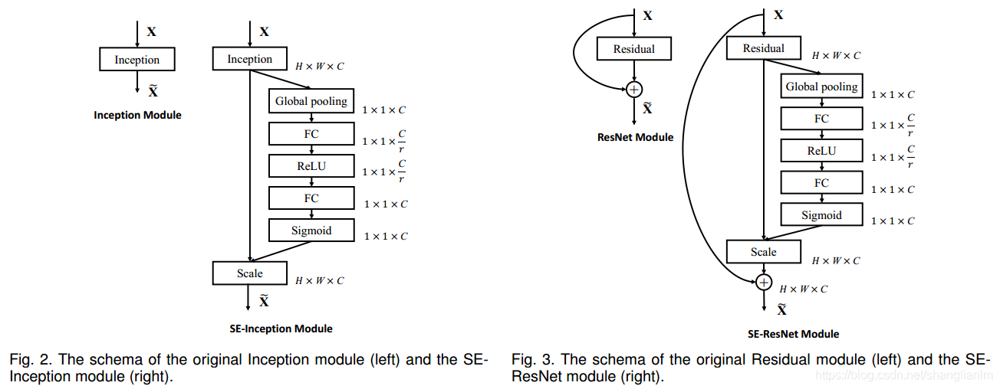

# CA [即插即用]
1. [github代码](https://github.com/Andrew-Qibin/CoordAttention)
2. [论文](https://arxiv.org/abs/2103.02907)

***
# SE (Squeeze-and-Excitation Networks)
## Paper
[Squeeze-and-Excitation Networks](https://arxiv.org/pdf/1709.01507.pdf)
> Squeeze-and-Excitation Networks（SENet）是由自动驾驶公司Momenta在2017年公布的一种全新的图像识别结构，它通过对特征通道间的相关性进行建模，把重要的特征进行强化来提升准确率。这个结构是2017 ILSVR竞赛的冠军，top5的错误率达到了2.251%，比2016年的第一名还要低25%，可谓提升巨大。
> 1. 概述
> SENet通过学习channel之间的相关性，筛选出了针对通道的注意力，稍微增加了一点计算量，但是效果提升较明显
> Squeeze-and-Excitation(SE) block是一个子结构，可以有效地嵌到其他分类或检测模型中。
> SENet的核心思想在于通过网络根据loss去学习feature map的特征权重来使模型达到更好的结果
> SE模块本质上是一种attention机制
> 2. Squeeze-and-Excitation模块
> Squeeze 操作对 C x H x W 进行global average pooling，得到大小为 C x 1 x 1 的特征图
> Excitation 操作 使用一个全连接神经网络，对Sequeeze之后的结果做一个非线性变换
> Reweight 操作 使用Excitation 得到的结果作为权重，乘到输入特征上

## Overview

##### Code
感谢[代码来源External-Attention-pytorch](https://github.com/xmu-xiaoma666/External-Attention-pytorch#1-Depthwise-Separable-Convolution-Usage)
[本库代码](SEAttention.py)
***

CBAM
DA
EA

# PSA
1. [别人介绍](https://mp.weixin.qq.com/s/KwU3rj1kF4UemmtIXsrcng)
2. [论文链接](https://arxiv.org/pdf/2107.00782.pdf)
3. [官网代码](https://github.com/DeLightCMU/PSA) （暂未开源）
4. [核心代码](https://github.com/xmu-xiaoma666/External-Attention-pytorch/blob/master/attention/PolarizedSelfAttention.py)
GC
# SimAM: A Simple, Parameter-Free Attention Module for Convolutional Neural Networks
1. [github代码](https://github.com/ZjjConan/SimAM)
2. [论文](http://proceedings.mlr.press/v139/yang21o.html)

# ACTION
1. [github代码](https://github.com/V-Sense/ACTION-Net)
2. [论文](https://arxiv.org/abs/2103.07372)