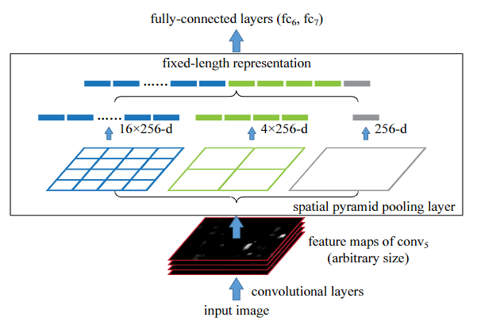

# SoftPool
1. [code](softpool.py)

# Global average pooling (GAP)
1. [code](./AvgPool2d.py)
2. [使用demo](../../../../test/cv/bases/pool/train_GAP.py)

# BlurPool
1. [code](BlurPool.py)
2. [论文](https://arxiv.org/abs/1904.11486)
3. [论文代码](https://github.com/adobe/antialiased-cnns)

# SPP
> 
1. [code](SPP.py)
2. [使用demo](../../../../test/cv/bases/pool/train_spppool.py)
3. [论文](https://arxiv.org/pdf/1406.4729.pdf)

https://arxiv.org/pdf/2108.07884.pdf
https://github.com/islamamirul/PermuteNet