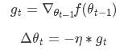
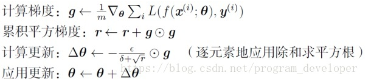
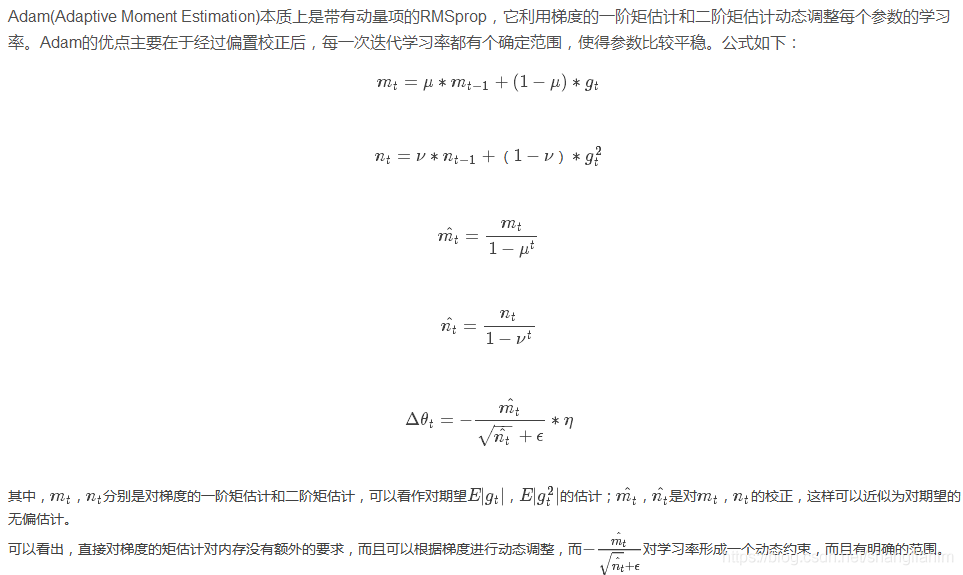

# SGD
> SGD就是每一次迭代计算mini-batch的梯度，然后对参数进行更新，是最常见的优化方法了。即：<br/>
> <br/>
> 其中，η ηη是学习率，g t g_{t}g t是梯度 <br/>
> params (iterable) – 待优化参数的iterable或者是定义了参数组的dict <br/>
> lr (float) – 学习率<br/>
> momentum (float, 可选) – 动量因子（默认：0）<br/>
> weight_decay (float, 可选) – 权重衰减（L2惩罚）（默认：0）<br/>
> dampening (float, 可选) – 动量的抑制因子（默认：0）<br/>
> nesterov (bool, 可选) – 使用Nesterov动量（默认：False）<br/>
> 可实现 SGD 优化算法，带动量 SGD 优化算法，带 NAG(Nesterov accelerated
gradient)动量 SGD 优化算法,并且均可拥有 weight_decay 项。<br/>
> **优缺点**：<br/>
SGD完全依赖于当前batch的梯度，所以ηη可理解为允许当前batch的梯度多大程度影响参数更新。对所有的参数更新使用同样的learning rate，选择合适的learning rate比较困难，容易收敛到局部最优。
## code
```python
import torch
optimizer = torch.optim.SGD(params, lr=0.001, momentum=0, dampening=0, weight_decay=0, nesterov=False)
```

# ASGD(平均随机梯度下降算法)
> ASGD 就是用空间换时间的一种 SGD。<br/>
> params (iterable) – 待优化参数的iterable或者是定义了参数组的dict <br/>
> lr (float, 可选) – 学习率（默认：1e-2）<br/>
> lambd (float, 可选) – 衰减项（默认：1e-4）<br/>
> alpha (float, 可选) – eta更新的指数（默认：0.75）<br/>
> t0 (float, 可选) – 指明在哪一次开始平均化（默认：1e6）<br/>
> weight_decay (float, 可选) – 权重衰减（L2惩罚）（默认: 0）
## code
```python
import torch
torch.optim.ASGD(params, lr=0.01, lambd=0.0001, alpha=0.75, t0=1000000.0, weight_decay=0)
```

# Adagrad
> AdaGrad算法就是将每一个参数的每一次迭代的梯度取平方累加后在开方，用全局学习率除以这个数，作为学习率的动态更新。<br/>
>  <br/>
> 其中，r rr为梯度累积变量，r rr的初始值为0。ε εε为全局学习率，需要自己设置。δ δδ为小常数，为了数值稳定大约设置为1 0 − 7 10^{-7}10 −7。<br/>
> params (iterable) – 待优化参数的iterable或者是定义了参数组的dict <br/>
lr (float, 可选) – 学习率（默认: 1e-2）<br/>
lr_decay (float, 可选) – 学习率衰减（默认: 0）<br/>
weight_decay (float, 可选) – 权重衰减（L2惩罚）（默认: 0）<br/>
> **优缺点**：<br/>
Adagrad 是一种自适应优化方法，是自适应的为各个参数分配不同的学习率。
>这个学习率的变化，会受到梯度的大小和迭代次数的影响。梯度越大，学习率越小；梯度越小，
>学习率越大。缺点是训练后期，学习率过小，因为 Adagrad 累加之前所有的梯度平方作为分母。
>随着算法不断迭代，r会越来越大，整体的学习率会越来越小。所以，一般来说AdaGrad算法一开始是激励收敛，
>到了后面就慢慢变成惩罚收敛，速度越来越慢。
## code
```python
import torch
optimizer = torch.optim.Adagrad(params, lr=0.01, lr_decay=0, weight_decay=0)
```

# adadelta(自适应学习率调整)
> Adadelta是对Adagrad的扩展，但是进行了计算上的简化。<br/>
Adagrad会累加之前所有的梯度平方，而Adadelta只累加固定大小的项，并且也不直接存储这些项，仅仅是近似计算对应的平均值。<br/>
> params (iterable) – 待优化参数的iterable或者是定义了参数组的dict<br/>
rho (float, 可选) – 用于计算平方梯度的运行平均值的系数（默认：0.9）<br/>
eps (float, 可选) – 为了增加数值计算的稳定性而加到分母里的项（默认：1e-6）<br/>
lr (float, 可选) – 在delta被应用到参数更新之前对它缩放的系数（默认：1.0）<br/>
weight_decay (float, 可选) – 权重衰减（L2惩罚）（默认: 0）<br/>
> **优缺点**：<br/>
Adadelta已经不依赖于全局学习率。训练初中期，加速效果不错，很快，训练后期，反复在局部最小值附近抖动。
## code
```python
import torch
optimizer = torch.optim.Adadelta(params, lr=1.0, rho=0.9, eps=1e-06, weight_decay=0)
```

# rmsprop
> RMSprop 和 Adadelta 一样，也是对 Adagrad 的一种改进。 RMSprop 采用均方根作为分<br/>
母，可缓解 Adagrad 学习率下降较快的问题， 并且引入均方根，可以减少摆动。<br/>
> params (iterable) – 待优化参数的iterable或者是定义了参数组的dict<br/>
lr (float, 可选) – 学习率（默认：1e-2）<br/>
momentum (float, 可选) – 动量因子（默认：0）<br/>
alpha (float, 可选) – 平滑常数（默认：0.99）<br/>
eps (float, 可选) – 为了增加数值计算的稳定性而加到分母里的项（默认：1e-8）<br/>
centered (bool, 可选) – 如果为True，计算中心化的RMSProp，并且用它的方差预测值对梯度进行归一化<br/>
weight_decay (float, 可选) – 权重衰减（L2惩罚）（默认: 0）<br/>
## code
```python
import torch
optimizer = torch.optim.RMSprop(params, lr=0.01, alpha=0.99, eps=1e-08, weight_decay=0, momentum=0, centered=False)
```

# Adam(自适应矩估计)
>  <br/>
> params (iterable) – 待优化参数的iterable或者是定义了参数组的dict<br/>
lr (float, 可选) – 学习率（默认：1e-3）<br/>
betas (Tuple[float, float], 可选) – 用于计算梯度以及梯度平方的运行平均值的系数（默认：0.9，0.999）<br/>
eps (float, 可选) – 为了增加数值计算的稳定性而加到分母里的项（默认：1e-8）<br/>
weight_decay (float, 可选) – 权重衰减（L2惩罚）（默认: 0）<br/>
>**优缺点**：<br/>
Adam的优点主要在于经过偏置校正后，每一次迭代学习率都有个确定范围，使得参数比较平稳。<br/>
Adam结合了Adagrad善于处理稀疏梯度和RMSprop善于处理非平稳目标的优点。
## code
```python
import torch
optimizer = torch.optim.Adam(params, lr=0.001, betas=(0.9, 0.999), eps=1e-08, weight_decay=0, amsgrad=False)
```

# Adamax
> Adamax 是对 Adam 增加了一个学习率上限的概念，所以也称之为 Adamax。
> params (iterable) – 待优化参数的iterable或者是定义了参数组的dict<br/>
lr (float, 可选) – 学习率（默认：2e-3）<br/>
betas (Tuple[float, float], 可选) – 用于计算梯度以及梯度平方的运行平均值的系数<br/>
eps (float, 可选) – 为了增加数值计算的稳定性而加到分母里的项（默认：1e-8）<br/>
weight_decay (float, 可选) – 权重衰减（L2惩罚）（默认: 0）<br/>
> **优缺点**：<br/>
Adamax是Adam的一种变体，此方法对学习率的上限提供了一个更简单的范围。
Adamax学习率的边界范围更简单。
## code
```python
import torch
optimizer = torch.optim.Adamax(params, lr=0.002, betas=(0.9, 0.999), eps=1e-08, weight_decay=0)
```

# SparseAdam
> 针对稀疏张量的一种“阉割版”Adam 优化方法。<br/>
> params (iterable) – 待优化参数的iterable或者是定义了参数组的dict<br/>
lr (float, 可选) – 学习率（默认：2e-3）<br/>
betas (Tuple[float, float], 可选) – 用于计算梯度以及梯度平方的运行平均值的系数<br/>
eps (float, 可选) – 为了增加数值计算的稳定性而加到分母里的项（默认：1e-8）<br/>
## code
```python
import torch
optimizer = torch.optim.SparseAdam(params, lr=0.001, betas=(0.9, 0.999), eps=1e-08)
```

# L-BFGS
> L-BFGS 属于拟牛顿算法。 L-BFGS 是对 BFGS 的改进，特点就是节省内存。<br/>
>lr (float) – 学习率（默认：1）<br/>
max_iter (int) – 每一步优化的最大迭代次数（默认：20）)<br/>
max_eval (int) – 每一步优化的最大函数评价次数（默认：max * 1.25）<br/>
tolerance_grad (float) – 一阶最优的终止容忍度（默认：1e-5）<br/>
tolerance_change (float) – 在函数值/参数变化量上的终止容忍度（默认：1e-9）<br/>
history_size (int) – 更新历史的大小（默认：100）<br/>
## code
```python
import torch
optimizer = torch.optim.LBFGS(params, lr=1, max_iter=20, max_eval=None, tolerance_grad=1e-05, tolerance_change=1e-09, history_size=100, line_search_fn=None)
```

# Rprop(弹性反向传播算法)
> 该优化方法适用于 full-batch，不适用于 mini-batch。不推荐。
>params (iterable) – 待优化参数的iterable或者是定义了参数组的dict<br/>
lr (float, 可选) – 学习率（默认：1e-2）<br/>
etas (Tuple[float, float], 可选) – 一对（etaminus，etaplis）, 它们分别是乘法的增加和减小的因子（默认：0.5，1.2）<br/>
step_sizes (Tuple[float, float], 可选) – 允许的一对最小和最大的步长（默认：1e-6，50）<br/>
## code
```python
import torch
optimizer = torch.optim.Rprop(params, lr=0.01, etas=(0.5, 1.2), step_sizes=(1e-06, 50))
```

# adamw
## code
```python
import torch
optimizer = torch.optim.AdamW(params, lr=0.001, betas=(0.9, 0.999), eps=1e-08, weight_decay=0.01, amsgrad=False)
```

# [radam](RAdam.py)
## [paper](https://arxiv.org/pdf/1908.03265v1.pdf)
> [作者源码](https://github.com/LiyuanLucasLiu/RAdam)
> [讲解参考](https://lessw.medium.com/new-state-of-the-art-ai-optimizer-rectified-adam-radam-5d854730807b)
> 
## code
```python
import torch
from .RAdam import RAdam
optimizer = RAdam(filter(lambda p: p.requires_grad, model.parameters()), lr=0.01, betas=(0.90, 0.999), eps=1e-08, weight_decay=1e-4)
```

# [ranger](Ranger.py)
## code
```python
import torch
from .Ranger import Ranger
optimizer = Ranger(filter(lambda p: p.requires_grad, model.parameters()), lr=0.01, betas=(0.95, 0.999), eps=1e-08, weight_decay=1e-4)
```


------------------------------------------------
# [utils](utils.py)
<table>
    <thead>
        <tr><th>名称</th><th>功能</th></tr>
    </thead>
    <tbody>
        <tr><td>get_current_lr</td><td>获取当前lr</td></tr>
    </tbody>
</table>

# 参考链接
1. https://www.zhihu.com/question/340834465