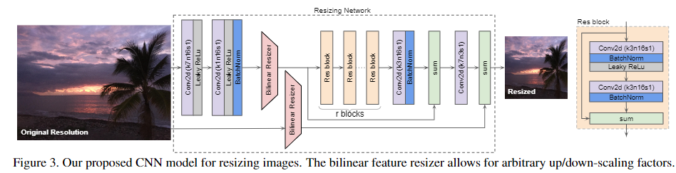

#### learnableResizer(Learning to Resize Images for Computer Vision Tasks)
##### Paper
[Learning to Resize Images for Computer Vision Tasks](https://arxiv.org/abs/2103.09950)
##### Overview

##### code
```python
self.learnable_resizer = ResizingNetwork()
x = self.learnable_resizer(x)
```